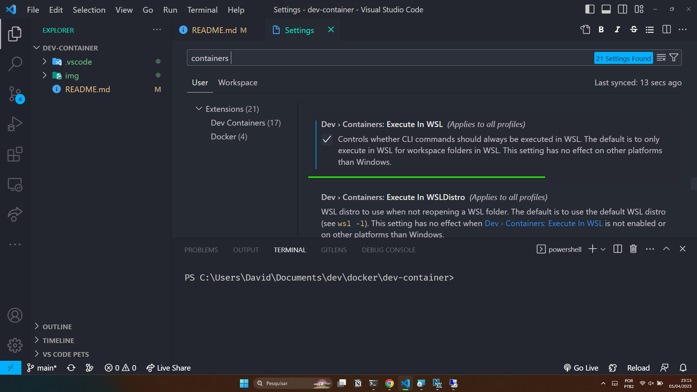
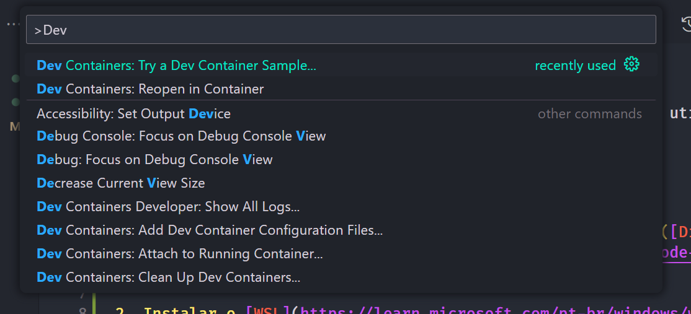
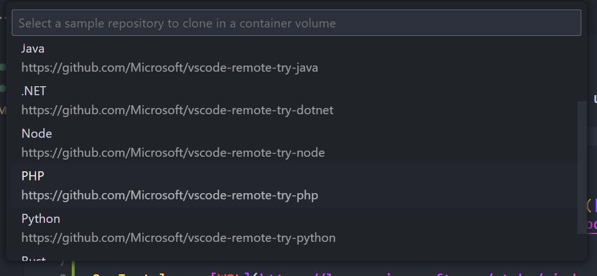
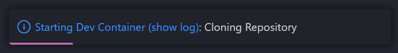

# dev-container
Instruções para realizar o desenvolvimento de dev-container utilizando docker e wsl no windows.

## Requisitos para funcionamento:

1. Instalar a extensão que permite desenvolvimento remoto. ([Disponível aqui](https://marketplace.visualstudio.com/items?itemName=ms-vscode-remote.vscode-remote-extensionpack)).

2. Instalar o [WSL](https://learn.microsoft.com/pt-br/windows/wsl/install). 

3. Instalar o [Docker](https://www.docker.com/) no wsl. ([Link para instalação](https://docs.docker.com/engine/install/ubuntu/))

## Configurando o VSCODE para trabalhar com WSL.

   1. Acessar as configurações de usuário através do `ctrl+shift+p`. (`>Preferences: Open User Settings`)
   2. Pesquisar `containers` nas configurações do usuário.
   3. Ativar a opção `Execute in container`.
   4. Com a opção marcada, certifique-se de que o docker do wsl esteja rodando. `docker ps`
   > Caso não estiver iniciado pode ser iniciado com o comando: `sudo service docker start`

   

## Configurando dev-container de teste:

1. Com os passos anteriores executados e funcionando.
2. Deve-se acessar através do `ctrl+shift+p` a opção `>Dev Containers: Try a Dev Container Sample`.

3. Selecionar o dev container de teste. Por exemplo do PHP.

4. Após deve ser apresentada a imagem de carregamento do container.

1. Logo o container deve abrir com o ambiente para desenvolvimento.

## Como abrir uma pasta em um dev container?

1. Para isso será necessário que nessa pasta tenha outra pasta com o nome `.devcontainer`
2. Dentro dessa pasta deve existir o arquivo de configuração do dev-container. Chamado `devcontainer.json`.
3. Sua estrutura pode ser variada, existem exemplos na internet de como fazer isso.
4. Após adicionar esses arquivos deve usar a opção `>Dev Containers: Reopen in Container`. Disponível no `ctrl+shift+p`.

5. Após executar isso o container deve abrir e ficar utilizável.

